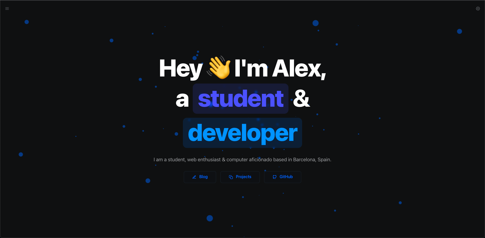

<div align="center">

<a target="_blank" href="https://alexste.com">
    
</a>

[](https://alexste.dev)
[](https://vercel.com/import/project?template=https://github.com/alexste/alexste)
[](https://vercel.com/home)

</div>

## 🛠 Development

Clone the repository

```zsh
git clone https://github.com/alexste/alexste.git
```

Install dependencies

```zsh
npm install

# Or using Yarn

yarn
```

Start the development server

```zsh
npm run dev

# Or using Yarn

yarn dev
```

Build for production

```zsh
npm run build

# Or using Yarn

yarn build
```
